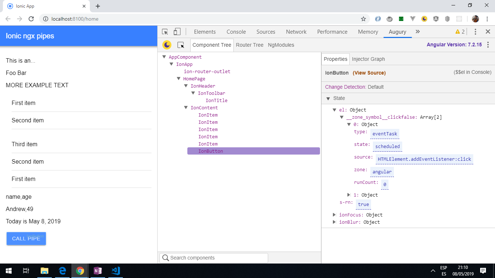

# :zap: Ionic ngx pipes

* This project uses [ngx pipes](https://www.npmjs.com/package/ngx-pipes) to modify the data shown to the user in the html template.

*** Note: to open web links in a new window use: _ctrl+click on link_**

## :page_facing_up: Table of contents

* [:zap: Ionic ngx pipes](#zap-ionic-ngx-pipes)
  * [:page_facing_up: Table of contents](#page_facing_up-table-of-contents)
  * [:books: General info](#books-general-info)
  * [:camera: Screenshots](#camera-screenshots)
  * [:signal_strength: Technologies](#signal_strength-technologies)
  * [:floppy_disk: Setup](#floppy_disk-setup)
  * [:computer: Code Examples](#computer-code-examples)
  * [:cool: Features](#cool-features)
  * [:clipboard: Status & To-Do List](#clipboard-status--to-do-list)
  * [:clap: Inspiration](#clap-inspiration)
  * [:envelope: Contact](#envelope-contact)

## :books: General info

* "The [ngx pipes](https://www.npmjs.com/package/ngx-pipes) can be used to modify strings, arrays, objects and use math and boolean operations.
* Also has a 'time ago' pipe but check if it only works with moment.js or if a lighter package like day.js can be used. It has only 1 dependancy. You only import the pipes you use, not a whole library.

## :camera: Screenshots



## :signal_strength: Technologies

* [Ionic framework/ v5](https://ionicframework.com/)
* [Angular CLI v11](https://cli.angular.io/)
* [Angular framework v11](https://angular.io/)
* [Ionic/angular v5](https://www.npmjs.com/package/ionic-angular)
* [ngx pipes v2](https://www.npmjs.com/package/ngx-pipes)
* [Angular Augury Chrome Extension v1](https://augury.rangle.io/) useful for debugging.

## :floppy_disk: Setup

* Run `ionic serve` for a dev server. Navigate to `http://localhost:8100/`. The app will automatically reload if you change any of the source files.

## :computer: Code Examples

* `home.page.html` extract showing use of pipes to show array keys and values, date and max value (callPipe function).

```html
<p>{{ myObj | keys }}</p> <!--name,age-->
<p>{{ myObj | values }}</p> <!--Andrew,49-->

<p>Today is {{ today | date }}</p>

<ion-button (click)="callPipe()">Call Pipe</ion-button>
```

```typescript
callPipe() {
    // this.datePipe.transform(Date);
    alert(this.maxPipe.transform(this.numbers));
}
```

## :cool: Features

* ngx-pipes has no external dependencies. Pipes are injectable and can be used in Components / Services / etc.

## :clipboard: Status & To-Do List

* Status: Working.
* To-Do: Try other pipes, especially the Math pipes.

## :clap: Inspiration

* [Ionic Academy: How to Simplify your Ionic 4 App with ngx-Pipes](https://www.youtube.com/watch?v=TaoO9-kkUDY).

## :envelope: Contact

* Repo created by [ABateman](https://www.andrewbateman.org) - you are welcome to [send me a message](https://andrewbateman.org/contact)
